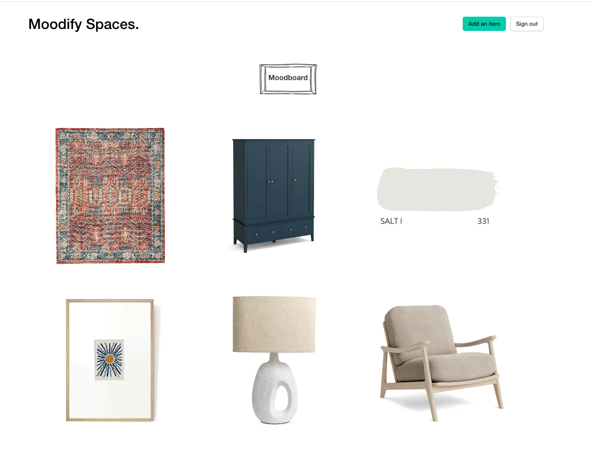
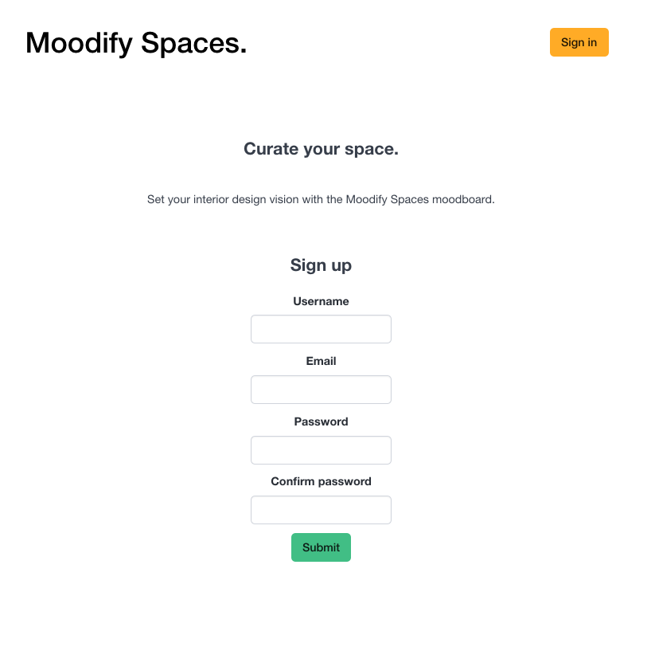
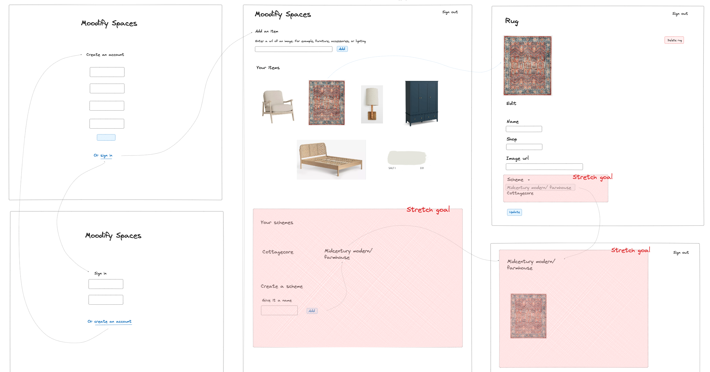

# Moodify Spaces 

Moodify Spaces allows you to add items to a moodboard to curate an interior scheme. 

# Features

You can add, edit and delete images from a moodboard.

You can add details about the item, so that you can find it again later, including:

* what it is called
* where it's from

Users need to sign up and sign in to create a moodboard.

# Future enhancements 

I would like to:

* allow users to create different interior design schemes (currently, you can only have one moodboard)
* find alternative ways to allow users to add images (currently, you need to add an image url)

# Screenshots

# Technologies

This site is built using Python, Django and React. 

# Planning materials 

